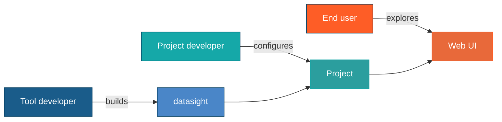

# Users and roles

datasight has three types of users. Understanding which role you play helps
you find the right documentation and get the most out of the tool.

## End user

The end user explores data through the web UI. They ask questions in plain
English, view tables and charts, and build dashboards. They typically don't
edit configuration files or write SQL directly.

End users need to know:

- How to use the chat interface, sidebar, and dashboard
- How to request specific chart types
- How clarification prompts work and why they appear
- How to review SQL with approval and explanation modes

An end user should never need to understand the system prompt, schema
introspection, or verification pipeline. The project developer has already
configured those.

## Project developer

The project developer creates a datasight project for a team. They connect
a database, write a schema description to give the AI domain context, curate
example queries that teach the AI correct SQL patterns, and run verification
to ensure the AI produces reliable results.

Project developers need to know:

- How to initialize a project and configure the database connection
- How to write effective schema descriptions and example queries
- How to add expected results and run `datasight verify` across models
- How to write deterministic questions that minimize ambiguity
- How to deploy for end users (configuration, remote databases)

The project developer is the quality gate. When an end user gets a wrong
answer, it's usually because the schema description was incomplete, an
example query was missing, or the question was ambiguous. The verification
system helps catch these issues before end users encounter them.

## Tool developer

The tool developer contributes to datasight itself -- adding features,
fixing bugs, or extending the LLM agent. They work with the Python source
code, the FastAPI web server, and the frontend.

Tool developers need to know:

- The system architecture and module structure
- How the LLM agent loop, tool execution, and SSE streaming work
- The CLI command structure
- How schema context is injected into the system prompt
