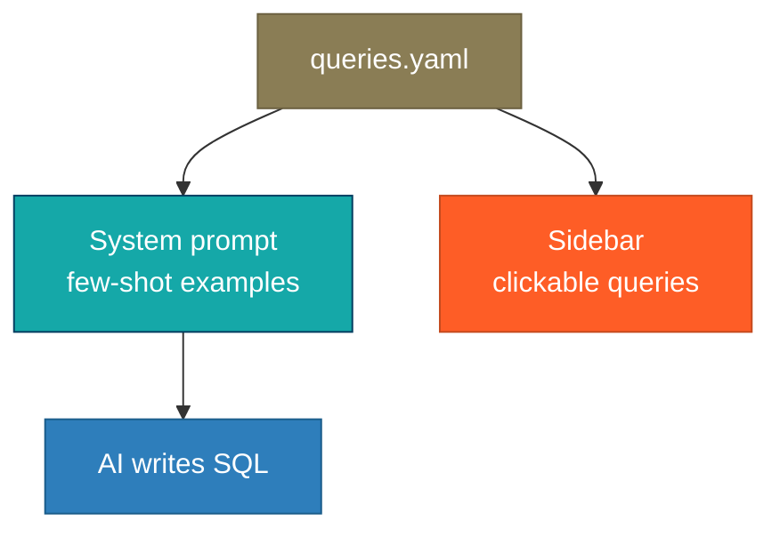

# Create example queries

The `queries.yaml` file teaches the AI how to write correct SQL for your
database. Each entry pairs a natural language question with its SQL answer.

## How examples are used



At startup, datasight:

1. Appends formatted examples to the AI system prompt as few-shot context
2. Displays them in the sidebar, filterable by selected table

When a user asks a question, the AI references these examples to write
accurate SQL. Users can also click any example query in the sidebar to
send it directly to the chat.

## File format

```yaml
# queries.yaml
- question: What are the top 10 customers by revenue?
  sql: |
    SELECT customer_name, SUM(amount) AS revenue
    FROM orders
    GROUP BY customer_name
    ORDER BY revenue DESC
    LIMIT 10

- question: Monthly order trend
  sql: |
    SELECT DATE_TRUNC('month', order_date) AS month,
           COUNT(*) AS order_count
    FROM orders
    GROUP BY month
    ORDER BY month
```

## Writing good examples

**Cover common questions.** What will your users ask most often?

**Show tricky patterns.** Joins, enum filters, and aggregations specific to
your schema are where examples help the most.

**Keep SQL readable.** The AI adapts the pattern — it doesn't copy verbatim.
Clear SQL teaches better than clever SQL.

**Include chart-friendly queries.** Two or three columns (one category/date +
one numeric) produce the cleanest visualizations.

**Aim for 5-15 examples.** Too few gives the AI little to work with. Too many
dilutes the signal and bloats the system prompt.

## Add expected results for verification

Each entry can include an `expected` block used by `datasight verify` to
validate that the AI generates correct SQL. See
[Verify queries across models](verification.md) for full details.

```yaml
- question: What are the top 5 states by solar generation?
  sql: |
    SELECT state, SUM(mwh) AS total
    FROM generation
    GROUP BY state
    ORDER BY total DESC
    LIMIT 5
  expected:
    row_count: 5
    columns: [state, total]
    contains: ["CA"]
```

Available checks: `row_count`, `min_row_count`, `max_row_count`, `columns`,
`contains`, `not_contains`.

## File location

By default, datasight looks for `queries.yaml` in the project directory.
Override with the `EXAMPLE_QUERIES_PATH` environment variable.
