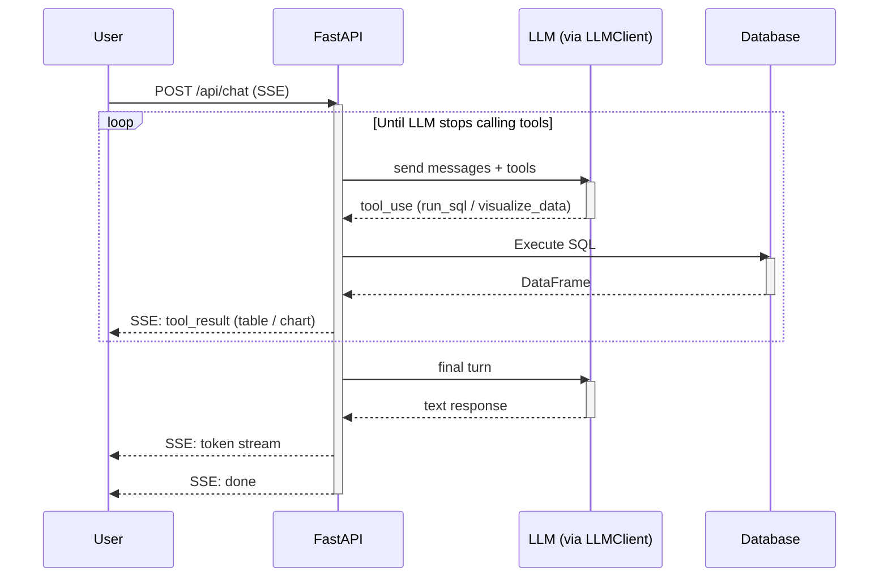
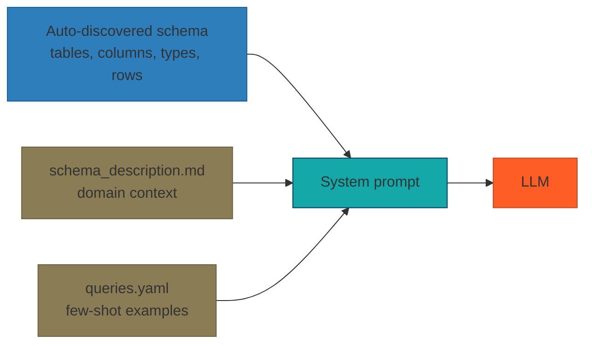

# Architecture

datasight is a FastAPI web server with a Svelte 5 + TypeScript + Tailwind
frontend (built with Vite, served as static assets by FastAPI). The LLM agent
loop, tool execution, and SSE streaming are implemented in plain Python, with
a pluggable `LLMClient` abstraction that supports Anthropic, GitHub Models,
and Ollama — see [Choosing an LLM](../use/concepts/choosing-an-llm.md) for
guidance on picking a provider.

## System overview

```mermaid
flowchart TB
    subgraph ui ["Web UI (FastAPI + SSE)"]
        WEB[FastAPI server]
        HTML[Svelte frontend]
    end

    subgraph agent ["LLM Agent Loop"]
        LLM[LLMClient]
        ANTH[Anthropic API]
        GH[GitHub Models]
        OLL[Ollama local]
        SQL[run_sql tool]
        VIZ[visualize_data tool]
        LLM -.-> ANTH
        LLM -.-> GH
        LLM -.-> OLL
        SQL --> RUNNER[SqlRunner]
        VIZ --> CHART[Interactive<br>ChartGenerator]
    end

    subgraph db ["Database"]
        DUCK[DuckDB<br>local file]
        SQLITE[SQLite<br>local file]
        PG[PostgreSQL<br>remote server]
        FLIGHT[Flight SQL<br>remote server]
    end

    HTML <-->|SSE stream| WEB
    WEB --> LLM
    LLM --> SQL
    LLM --> VIZ
    RUNNER --> DUCK
    RUNNER --> SQLITE
    RUNNER --> PG
    RUNNER --> FLIGHT

    style WEB fill:#15a8a8,stroke:#023d60
    style HTML fill:#15a8a8,stroke:#023d60
    style LLM fill:#023d60,stroke:#023d60
    style ANTH fill:#023d60,stroke:#023d60
    style GH fill:#023d60,stroke:#023d60
    style OLL fill:#023d60,stroke:#023d60
    style SQL fill:#023d60,stroke:#023d60
    style VIZ fill:#023d60,stroke:#023d60
    style RUNNER fill:#bf1363,stroke:#023d60
    style CHART fill:#bf1363,stroke:#023d60
    style DUCK fill:#fe5d26,stroke:#023d60
    style SQLITE fill:#fe5d26,stroke:#023d60
    style PG fill:#fe5d26,stroke:#023d60
    style FLIGHT fill:#fe5d26,stroke:#023d60
    style ui fill:#f0fafa,stroke:#15a8a8
    style agent fill:#f0f0fa,stroke:#023d60
    style db fill:#fff5f0,stroke:#fe5d26
```

## Request flow

## Modules

`datasight.cli`
: Click CLI entry point. See the [CLI reference](../reference/cli.md) for the
  full command tree.

`datasight.agent`
: Shared agent loop and tool execution. Used by both the web UI and the
  headless `ask` CLI. Contains `run_agent_loop()`, `execute_tool()`, and
  Plotly spec resolution helpers.

`datasight.settings`
: Typed settings loaded from `.env` / environment variables (LLM provider,
  database connection, feature flags).

`datasight.config`
: Configuration helpers — loads schema descriptions, example queries, and
  creates SQL runners from settings.

`datasight.schema`
: Database introspection. Discovers tables, columns, and row counts using
  multiple strategies (DuckDB `SHOW TABLES`, `INFORMATION_SCHEMA`, SQLite
  `PRAGMA table_info`).

`datasight.llm`
: LLM client abstraction with implementations for Anthropic, GitHub Models,
  and Ollama. Converts between provider-specific message and tool formats.

`datasight.prompts`
: System prompt assembly — stitches schema, descriptions, example queries,
  and tool guidance into the LLM context.

`datasight.chart`
: Interactive Plotly chart generator with chart-type switching buttons.

`datasight.runner`
: SQL execution backends — `DuckDBRunner` and `SQLiteRunner` for local files,
  `PostgresRunner` for PostgreSQL servers, and `FlightSqlRunner` for remote
  databases via Arrow gRPC.

`datasight.sql_validation`
: SQL parsing and safety checks with `sqlglot` — rejects non-SELECT
  statements and flags dialect issues before execution.

`datasight.query_log`
: Append-only JSON log of every executed query, surfaced by
  `datasight log`.

`datasight.cost`
: Token accounting and cost estimation per LLM call and per session.

`datasight.verify`
: Query verification engine used by `datasight verify` to replay example
  queries across models and compare results.

`datasight.data_profile`, `datasight.integrity`, `datasight.distribution`, `datasight.validation`, `datasight.audit_report`
: Data-quality commands — profiling, integrity checks, distribution
  statistics, validation rules, and the combined audit report.

`datasight.explore`
: Ad-hoc file exploration for the `inspect` command (CSV / Parquet without
  a project).

`datasight.generate`
: LLM-assisted project scaffolding (`datasight generate`) — produces schema
  descriptions and example queries from raw data files.

`datasight.export`
: Converts a conversation session into self-contained exports: HTML,
  runnable Python, and portable bundle archives with SQL, CSV extracts,
  Plotly specs, and provenance metadata.

`datasight.web.app`
: FastAPI application with SSE streaming, tool execution, and REST API
  endpoints for schema, query browsing, dashboards, and saved reports.

`datasight.demo`, `datasight.demo_dsgrid_tempo`, `datasight.demo_time_validation`
: Demo-project generators — download EIA generation data, NREL TEMPO EV
  charging projections, and a synthetic time-validation dataset,
  respectively.

## Schema context injection

The AI receives database context at startup, which is included in every
system prompt:

The schema is introspected once at startup. The description and example queries
are loaded from disk and formatted into the prompt. Together, they give the AI
enough context to write accurate SQL without needing to explore the database
itself.

## Timeouts and retries

### Query timeouts

All SQL runners enforce a configurable timeout on query execution
(default: **120 seconds**). The timeout wraps the `asyncio.to_thread` call
with `asyncio.wait_for`, so it applies at the async layer regardless of the
database backend.

When a query times out, the runner raises `QueryTimeoutError` (a subclass
of `QueryError`). The agent loop catches this and returns a descriptive
error message to the LLM so it can retry with a simpler query.

The default is set by `DEFAULT_QUERY_TIMEOUT` in `datasight.runner`. Each
runner accepts a `query_timeout` parameter in its constructor to override
the default.

### LLM timeouts

Both the Anthropic and OpenAI-compatible LLM clients pass a timeout to their
underlying SDK clients (default: **120 seconds**, set by
`DEFAULT_LLM_TIMEOUT` in `datasight.llm`). This prevents indefinite hangs
when an API endpoint is unresponsive.

### LLM retries

Transient LLM failures are retried automatically with exponential backoff:

- **Max attempts:** 3 (set by `DEFAULT_MAX_RETRIES`)
- **Base delay:** 1 second, doubled each retry (1s, 2s, 4s)
- **Anthropic:** retries on `APIConnectionError` and `RateLimitError` (429).
  Other `APIStatusError` responses (auth failures, validation errors) fail
  immediately.
- **OpenAI-compatible:** retries on errors whose message contains
  `connection`, `timeout`, `rate`, `429`, `502`, `503`, or `504`. All other
  errors fail immediately.

### Client disconnect detection

The SSE chat generator checks `request.is_disconnected()` before each LLM
call and before each tool execution. When the user clicks **Stop** in the
web UI, the frontend aborts the fetch request, and the backend detects the
disconnect and stops processing — avoiding wasted LLM API calls and
database queries.

## Web UI

The frontend is built with **Svelte 5 + TypeScript + Tailwind CSS** and uses
Vite as the build tool. Source lives in `frontend/` and is compiled to static
assets served by FastAPI. Generated assets under `src/datasight/web/static/`
and `src/datasight/web/templates/index.html` are ignored by git; run
`bash scripts/build-frontend.sh` after a clean checkout or before packaging to
create them. It features:

- **Sidebar** with a table browser (expandable columns) and example queries
  that filter by selected table
- **SSE streaming** for real-time token-by-token responses
- **Inline tool results** — data tables and interactive Plotly charts rendered
  directly in the chat
- **Markdown rendering** with syntax-highlighted SQL code blocks
