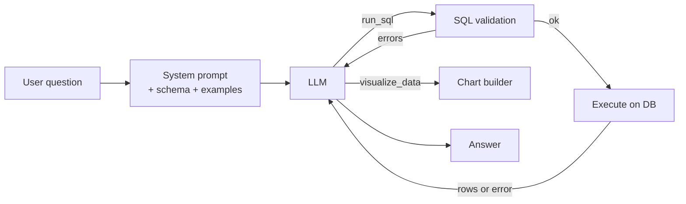

# How the agent works

datasight turns a natural-language question into SQL, runs it, and hands
the result back — sometimes as a table, sometimes as a Plotly chart. The
component doing that translation is an LLM-driven agent, and like any LLM
it can hallucinate: invent table names, misread a column, or confidently
aggregate the wrong way. This page explains at a high level what the
agent does and what datasight does around it to keep errors rare and
catchable.

## The loop

Each question runs through a small tool-use loop:

The LLM does not talk to the database directly. It can only call two
tools — `run_sql` and `visualize_data` — and every `run_sql` call passes
through validation and then the database engine before any result comes
back. If either step returns an error, the error is fed back into the
conversation so the model can self-correct on the next turn.

## What the model is told

The system prompt is assembled for each session from project-controlled
inputs, not freeform text:

- **Schema information.** Table names, column names, types, and any
  descriptions the project author wrote.
- **Example queries.** Curated question/SQL pairs from the project, which
  anchor the model to the dialect and table conventions actually in use.
- **Semantic measures.** Declared rules for how specific columns may be
  aggregated (for example, "this is a rate — don't SUM it").
- **Dialect hints.** The target SQL dialect (DuckDB, SQLite, Postgres),
  so the model doesn't mix syntax.

Raw table data is never uploaded. The model sees names, descriptions,
and small result samples — not the underlying rows at scale.

## Mitigations layered around the model

The model is the weakest link, so datasight does not rely on it alone.

**SQL parsing and table validation.** Every generated query is parsed
with [sqlglot](https://github.com/tobymao/sqlglot) before it touches the
database. Unknown table names are
rejected with an error message that lists the available tables, which
the model uses to correct itself on the next turn. Column validation is
deliberately left to the database engine — its error messages are
precise and the model recovers from them well.

**Semantic measure rules.** When a project declares that a column is a
rate, a ratio, or otherwise non-additive, the validator blocks
aggregations that would produce a nonsense number — even if the SQL is
otherwise well-formed.

**Math in the database, not the model.** For trendlines and linear
regressions, the prompt directs the model to use the database's own
regression aggregates (`regr_slope`, `regr_intercept`, `regr_r2` on
DuckDB and Postgres; an equivalent closed-form computation on SQLite)
rather than inventing the arithmetic itself. The slope and intercept
come from the engine, not the LLM, so the fitted line is reproducible
and not at the mercy of a model's floating-point guesswork.

**Dialect-aware parsing.** Validation uses the same dialect the query
will run under, so dialect-specific syntax isn't falsely flagged.

**Query confidence controls.** Users can require SQL approval before
execution and ask the model to explain its query in plain English. See
[Query confidence toggles](../reference/query-confidence-toggles.md).

**Clarifying questions.** When a question is ambiguous along a dimension
that changes the answer (granularity, time range, units), the agent is
prompted to ask rather than guess. See
[Why clarifying questions appear](../use/concepts/query-confidence.md).

**The query log.** Every SQL statement the agent runs is logged with its
question, timing, and row count, so you can audit after the fact. See
[Review the SQL query log](../use/how-to/review-query-log.md).

**Per-question cost budget.** The agent tracks estimated LLM cost across
the tool-use loop and aborts with a visible stop message once a
configurable USD cap is reached, so a runaway loop can't silently burn
tokens. The cap defaults to `$1.00` per question and is controlled by
`MAX_COST_USD_PER_TURN` — see
[Configuration reference](../reference/configuration.md).

**Cross-model verification.** For high-stakes questions, the `verify`
workflow re-runs a question across multiple LLMs and compares results.
Disagreement is a signal to investigate. See
[Verify queries across models](../project-setup/how-to/verification.md).

## What mitigations don't catch

None of the above proves a query is *right*. They catch hallucinated
tables, disallowed aggregations, and obvious parse errors — but a query
can reference real tables, respect every rule, run cleanly, and still
answer the wrong question. For this reason datasight treats results as
drafts. See [Trusting AI-generated results](../use/concepts/trusting-ai-results.md)
for the posture we recommend when acting on them.

## Where to read more

- [Choosing an LLM](../use/concepts/choosing-an-llm.md) — model selection and data
  sensitivity tradeoffs.
- [SQL result cache](sql-result-cache.md) — how repeat queries are
  served without re-running the model or the database.
- [Architecture](architecture.md) — the code-level view
  of the same loop.
