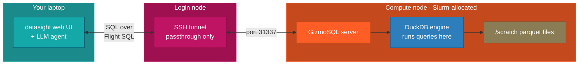

# Connect to a remote Flight SQL backend (GizmoSQL)

This guide covers configuring datasight to talk to a remote
[GizmoSQL](https://github.com/gizmodata/gizmosql) server over the Arrow
Flight SQL protocol. The common use is running GizmoSQL on an HPC compute
node while datasight runs on your laptop — queries travel over an SSH
tunnel and results come back.

## When to use this

Most HPC users are better served by
[running datasight directly on a compute node](run-on-hpc.md).
Reach for a Flight SQL backend when:

- **You want a shared server.** A single GizmoSQL process can serve
  multiple analysts concurrently, each running their own datasight
  client.
- **You can't install datasight in the HPC environment.** Rare, but
  possible on locked-down clusters.
- **Your LLM calls must originate from your laptop.** Either because
  policy forbids compute-node egress to hosted APIs, or because you want
  to run a local model on your laptop's GPU. Keeping the agent
  client-side while the engine stays server-side handles both cases.

If none of those apply, use the simpler path.

## Overview

GizmoSQL and DuckDB run on an **allocated compute node** on the HPC — not
on your laptop or the login node. Your laptop only runs datasight (the web
UI and LLM agent). It sends SQL queries over an SSH tunnel and receives
results back. All data processing stays on the HPC.



!!! important
    **Do not run GizmoSQL on the login node.** DuckDB queries can be CPU- and
    memory-intensive. Always allocate a compute node with Slurm first, then
    start GizmoSQL on that node.

Steps:

1. On the HPC login node: install GizmoSQL and prepare your database
2. Allocate a compute node with Slurm
3. On the compute node: start GizmoSQL
4. On your laptop: open an SSH tunnel through the login node to the compute node
5. On your laptop: run `datasight run`

## Step 1: Install GizmoSQL on the HPC

!!! tip
    **NLR Kestrel users:** A pre-built `gizmosql_server` binary is already
    available at `/scratch/dthom/gizmosql/gizmosql_server`. You can skip the
    installation instructions below and go straight to
    [Step 2](#step-2-create-views-over-parquet-files).

Download a pre-built binary from the
[GizmoSQL releases page](https://github.com/gizmodata/gizmosql/releases).
Choose the Linux x86-64 or ARM64 archive matching your HPC architecture,
extract it, and place the binaries somewhere on your `$PATH`:

```bash
# Example: download and extract the latest release
tar xzf gizmosql-linux-amd64.tar.gz
mv gizmosql_server gizmosql_client ~/.local/bin/
```

!!! warning
    The pre-built binaries require a recent GLIBC version. If your HPC runs an
    older operating system (e.g. CentOS 7, RHEL 7), you may see errors like
    `GLIBC_2.XX not found` when trying to run the binary. In that case, use
    the Apptainer container image instead — it bundles its own libraries and
    avoids GLIBC compatibility issues entirely.

**Apptainer container (recommended if binaries don't work):**

Most HPC systems provide [Apptainer](https://apptainer.org/) (formerly
Singularity) instead of Docker. Pull the GizmoSQL container image once
from the login node:

```bash
apptainer pull gizmosql.sif docker://gizmodata/gizmosql:latest
```

This creates a `gizmosql.sif` file you can run without root privileges.
Store it somewhere accessible from compute nodes (e.g. your home directory
or a shared project directory).

**Building from source (last resort):**

Building GizmoSQL from source requires CMake, Ninja, a C++17 compiler, and
several system dependencies (Apache Arrow, DuckDB, gRPC, Protobuf). This is
non-trivial on HPC systems where you may not have root access to install
build dependencies. Only attempt this if neither the pre-built binary nor
the Apptainer container works for your environment.

```bash
git clone https://github.com/gizmodata/gizmosql --recurse-submodules
cd gizmosql
cmake -S . -B build -G Ninja -DCMAKE_INSTALL_PREFIX=$HOME/.local
cmake --build build --target install
export PATH="$HOME/.local/bin:$PATH"
```

## Step 2: Create views over parquet files

You have two options for how GizmoSQL manages the database:

**Option A: Persistent database file (recommended)**

Create a `.duckdb` file ahead of time. DuckDB caches parquet metadata in the
file, so subsequent startups are fast and the database survives restarts.
You can do this from the login node since it's a one-time setup:

```bash
duckdb /scratch/project/mydata.duckdb
```

```sql
CREATE VIEW measurements AS
SELECT * FROM read_parquet('/scratch/project/data/measurements.parquet');

CREATE VIEW stations AS
SELECT * FROM read_parquet('/scratch/project/data/stations.parquet');

-- Glob patterns work for partitioned datasets
CREATE VIEW events AS
SELECT * FROM read_parquet('/scratch/project/data/events/**/*.parquet');

-- Pre-aggregate for common queries
CREATE VIEW daily_summary AS
SELECT
    station_id,
    DATE_TRUNC('day', timestamp) AS day,
    AVG(value) AS avg_value,
    COUNT(*) AS n_obs
FROM read_parquet('/scratch/project/data/measurements.parquet')
GROUP BY station_id, day;

SHOW TABLES;
```

**Option B: In-memory with init script**

If you prefer not to leave a database file on disk, GizmoSQL can create an
in-memory database and populate it from a SQL script at startup. Write the
same SQL above into an `init.sql` file and pass `:memory:` as the database
filename (see Step 4).

The trade-off: DuckDB must scan all parquet file metadata on every startup,
which can take time if you have many or large files. With a persistent file,
this scan happens once.

## Step 3: Allocate a compute node

Use Slurm to allocate a compute node. Request enough memory for DuckDB to
process your data and enough time for your interactive session.

**Interactive allocation with `salloc`:**

```bash
salloc --time=4:00:00 --mem=240G --cpus-per-task=104 --account <your-account>
```

Once allocated, note the compute node hostname — you'll need it for the SSH
tunnel. You can find it with:

```bash
hostname
# or
squeue --me --format="%N" --noheader
```

**Batch job with `sbatch`:**

If you prefer a batch job, create a script:

```bash
#!/bin/bash
#SBATCH --time=4:00:00
#SBATCH --mem=240G
#SBATCH --cpus-per-task=104
#SBATCH --job-name=gizmosql
#SBATCH --account=<your-account>

echo "GizmoSQL running on node: $(hostname)"

apptainer run \
    --bind /scratch/project:/scratch/project \
    --env GIZMOSQL_PASSWORD="your_password" \
    --env PRINT_QUERIES="1" \
    --env DATABASE_FILENAME="/scratch/project/mydata.duckdb" \
    ~/gizmosql.sif
```

If you have the `gizmosql_server` binary available (on Kestrel it lives at
`/scratch/dthom/gizmosql/gizmosql_server`), you can skip Apptainer and run
it directly:

```bash
#!/bin/bash
#SBATCH --time=4:00:00
#SBATCH --mem=240G
#SBATCH --cpus-per-task=104
#SBATCH --job-name=gizmosql
#SBATCH --account=<your-account>

echo "GizmoSQL running on node: $(hostname)"

/scratch/dthom/gizmosql/gizmosql_server \
    --database-filename /scratch/project/mydata.duckdb \
    --password "your_password" \
    --print-queries
```

```bash
sbatch gizmosql.sh
```

Check the job output to find the compute node hostname.

## Step 4: Start GizmoSQL on the compute node

If you used `salloc`, you're now on the compute node. Start GizmoSQL:

**With Apptainer (recommended):**

Bind-mount the directories containing your database and parquet files so the
container can access them.

With a persistent database file (Option A):

```bash
apptainer run \
    --bind /scratch/project:/scratch/project \
    --env GIZMOSQL_PASSWORD="your_password" \
    --env PRINT_QUERIES="1" \
    --env DATABASE_FILENAME="/scratch/project/mydata.duckdb" \
    ~/gizmosql.sif
```

With an in-memory database and init script (Option B):

```bash
apptainer run \
    --bind /scratch/project:/scratch/project \
    --env GIZMOSQL_PASSWORD="your_password" \
    --env PRINT_QUERIES="1" \
    --env DATABASE_FILENAME=":memory:" \
    --env INIT_SQL_COMMANDS_FILE="/scratch/project/init.sql" \
    ~/gizmosql.sif
```

If your parquet files span multiple directories, add multiple bind mounts:

```bash
apptainer run \
    --bind /scratch/project:/scratch/project \
    --bind /data/shared:/data/shared \
    --env GIZMOSQL_PASSWORD="your_password" \
    --env DATABASE_FILENAME="/scratch/project/mydata.duckdb" \
    ~/gizmosql.sif
```

**With a native install** (on Kestrel, use `/scratch/dthom/gizmosql/gizmosql_server`):

```bash
# Option A: persistent file
/scratch/dthom/gizmosql/gizmosql_server \
    --database-filename /scratch/project/mydata.duckdb \
    --password "your_password" \
    --print-queries

# Option B: in-memory with init script
/scratch/dthom/gizmosql/gizmosql_server \
    --database-filename :memory: \
    --init-sql-commands-file ./init.sql \
    --password "your_password" \
    --print-queries
```

**Key flags:**

| Flag | Default | Description |
|------|---------|-------------|
| `--database-filename` | *(required)* | Path to `.duckdb` file, or `:memory:` |
| `--init-sql-commands-file` | — | SQL script to run at startup |
| `--port` | `31337` | Listen port |
| `--username` / `GIZMOSQL_USERNAME` | `gizmosql_user` | Login username |
| `--password` / `GIZMOSQL_PASSWORD` | *(required)* | Login password |
| `--print-queries` / `PRINT_QUERIES` | off | Log queries to stdout |
| `--tls` / `TLS_ENABLED` | off | Enable TLS |

## Step 5: Open an SSH tunnel

On your laptop, tunnel through the login node to the compute node where
GizmoSQL is running. Replace `compute-node-42` with your actual node
hostname from Step 3:

```bash
ssh -N -L 31337:compute-node-42:31337 user@hpc-login-node
```

Leave this running in a separate terminal.

!!! tip
    If your HPC allows direct SSH to compute nodes from the login node, you can
    verify GizmoSQL is reachable before setting up the tunnel:
    `nc -zv compute-node-42 31337`

## Step 6: Configure datasight

On your laptop, edit `.env` in your project directory:

```bash
# Use any LLM provider (see Getting Started for options)
ANTHROPIC_API_KEY=sk-ant-...

DB_MODE=flightsql
FLIGHT_SQL_URI=grpc://localhost:31337
FLIGHT_SQL_USERNAME=gizmosql_user
FLIGHT_SQL_PASSWORD=your_password
```

If TLS is enabled on GizmoSQL, use `grpc+tls://localhost:31337`.

## Step 7: Run datasight

Make sure your project directory also contains `schema_description.md` and
`queries.yaml` if you want to give the AI domain context and example queries.
These files live on your laptop alongside `.env` — they are read locally by
datasight and are not sent to the HPC.

```bash
datasight run
```

datasight connects through the SSH tunnel to GizmoSQL on the compute node,
introspects all tables and views, and starts the web UI at
<http://localhost:8084>. All SQL queries are executed by DuckDB on the
compute node — only the results travel back to your laptop.

## Tips

- **Prefer a database file** over `:memory:` for large datasets. A persistent
  `.duckdb` file caches parquet metadata so restarts are fast. With `:memory:`,
  DuckDB re-scans all parquet metadata on every startup.
- **Request enough memory** in your Slurm allocation. DuckDB can be
  memory-hungry for large aggregations. Start with `--mem=32G` and adjust.
- **Pre-aggregate in views** for common queries. A `daily_summary` view is
  much faster than scanning raw data every time.
- **Write a `schema_description.md`** explaining your data — the AI discovers
  structure automatically, but domain context makes it much more useful.
- **Monitor with `--print-queries`** (or `PRINT_QUERIES=1` in Apptainer) on
  the compute node to see what SQL the AI generates.
- **Bind-mount carefully** with Apptainer — the container can only see paths
  that are explicitly bound. If queries fail with "file not found", check your
  `--bind` flags.
- **Check your Slurm time limit.** When the job ends, GizmoSQL stops and
  the tunnel breaks. For long sessions, request generous `--time` or use
  `salloc` so you can extend interactively.
