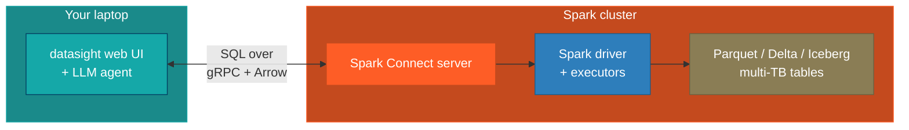
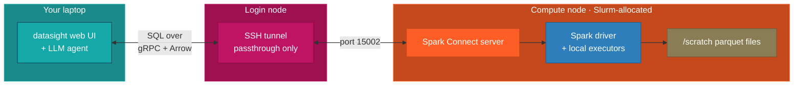
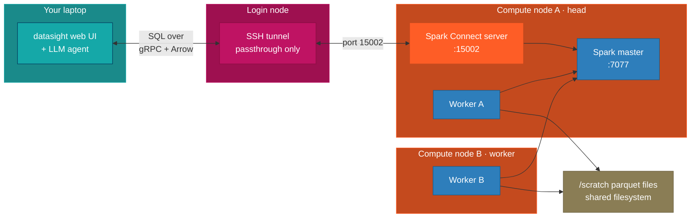

# Connect to an Apache Spark backend

This guide covers configuring datasight to talk to an Apache Spark cluster
over [Spark Connect](https://spark.apache.org/docs/latest/spark-connect-overview.html).
Use this when your data is too large to fit on a single machine — typically
multi-terabyte Parquet, Delta, or Iceberg tables managed by Spark.

## When to use this

Reach for the Spark backend when:

- **Your data is on a Spark cluster.** Generation data partitioned across
  years of `report_date`, plant-level fuel consumption at sub-hourly
  resolution, or any other multi-TB table set that a single laptop cannot
  scan.
- **Someone else runs the cluster.** A data platform team at your
  organization already operates Spark with Spark Connect enabled — you just
  need a URI and credentials.
- **You want aggregations, not row dumps.** datasight's agent is steered
  (via the system prompt) to always aggregate, always filter on partition
  columns, and never `SELECT *` on Spark tables. The results come back as
  small summaries suitable for a chart, not multi-gigabyte exports.

If your data fits on one machine, prefer DuckDB — it will be much faster
for interactive exploration.

## Overview

Spark Connect decouples the client from the cluster. datasight (the web UI
and LLM agent) runs on your laptop; the Spark driver and executors run on
your cluster. Your laptop never materializes more than a bounded slice of
any result.



Queries travel as Spark logical plans over gRPC. Results stream back as
Arrow record batches. datasight stops reading the stream once the
accumulated result exceeds `SPARK_MAX_RESULT_BYTES` (default 100 MiB) and
surfaces a truncation warning in the UI and to the LLM.

## Prerequisites

- A Spark cluster running **Spark 3.5 or newer** with the Spark Connect
  server enabled.
- The **Spark Connect URI** for that cluster — typically `sc://host:15002`.
  Ask your data platform team if you don't know it.
- A **bearer token** if the cluster requires authentication.

!!! tip
    If you're not sure whether Spark Connect is enabled, ask for the URI.
    Clusters running Databricks, EMR, or self-managed Spark with the
    `spark.api.mode=connect` config have a Connect endpoint.

## Step 1: Install the Spark extra

The Spark Connect client isn't bundled by default because it pulls in
pyspark. Install the extra on your laptop:

```bash
pip install 'datasight[spark]'
```

This adds `pyspark[connect]>=3.5` to your environment. No Java is
required — the Connect client is pure Python and talks to the cluster
over gRPC.

## Step 2: Configure the connection

In your project's `.env`:

```bash
# Use any LLM provider (see Getting Started for options)
ANTHROPIC_API_KEY=sk-ant-...

DB_MODE=spark
SPARK_REMOTE=sc://spark-connect.example.com:15002
SPARK_TOKEN=your_bearer_token            # optional, only if the cluster requires auth
```

### Tuning the byte cap

datasight caps client-side result size to protect your laptop (and, if you
host the web UI for others, the web server) from OOMing when the agent
writes a query that returns too much data. The default is 100 MiB on the
wire, which inflates to roughly 250–500 MiB as a pandas DataFrame.

Raise or lower the cap to match your environment:

```bash
# Default — safe for most laptops and small web deployments
SPARK_MAX_RESULT_BYTES=104857600         # 100 MiB

# Lower for memory-constrained environments
SPARK_MAX_RESULT_BYTES=26214400          # 25 MiB

# Higher if you trust the queries and have the RAM
SPARK_MAX_RESULT_BYTES=524288000         # 500 MiB
```

When a result is truncated, the UI shows a banner and the LLM sees a
partial-result warning in its tool output — so the agent can say "showing
the first 2M rows; add aggregation for the full answer" instead of
silently misreporting truncated data.

## Step 3: Describe the schema for multi-TB scale

datasight introspects tables automatically, but for Spark it deliberately
**skips row counts** — a naive `SELECT COUNT(*)` on a partitioned
multi-TB table kicks off a full-cluster job every time the project loads.

To help the agent write cheap queries, document your partition columns
explicitly in `schema_description.md`:

```markdown
## generation_fuel

Daily net generation and fuel consumption by plant, aggregated from the
EIA-923 hourly feed. Approximately 4 billion rows.

**Partition columns:** `report_date` (daily), `energy_source_code`.
Always include a `report_date` filter — e.g. `WHERE report_date >=
'2024-01-01'` — otherwise the query scans the full history.

**Columns:**
- `plant_id` (int) — EIA plant identifier
- `report_date` (date) — partition key
- `energy_source_code` (varchar) — partition key; 'NG', 'COL', 'NUC', 'WND', etc.
- `net_generation_mwh` (double) — MWh produced in the period
- `fuel_consumed_units` (double) — physical units of fuel consumed
- `fuel_consumed_mmbtu` (double) — heat content consumed
```

Partition hints in the schema description flow into the system prompt, so
the agent learns to write `WHERE report_date >= '2024-01-01' AND
energy_source_code = 'NG'` instead of full-table scans.

## Step 4: Run datasight

```bash
datasight run
```

datasight connects to the Spark Connect server via `spark.catalog.listTables()`,
pulls column metadata for each table, and starts the web UI at
<http://localhost:8084>. Ask a question and the agent writes Spark SQL
against your tables.

### Verifying you're actually distributed

On startup, datasight logs the Spark session details it sees from the
Connect server. Look for a block like this in the terminal output:

```text
INFO  Spark session info:
  version                                   = 3.5.1
  spark.master                              = spark://master-node:7077
  spark.app.name                            = datasight
  spark.app.id                              = app-20260422-0001
  spark.default.parallelism                 = 208
  spark.sql.shuffle.partitions              = 200
  spark.executor.instances                  = 2
  spark.executor.cores                      = 104
  spark.executor.memory                     = 200g
  spark.dynamicAllocation.enabled           = false
```

The field to check first is **`spark.master`**:

- `spark://host:7077` — connected to a standalone cluster. ✓ distributed
- `yarn` / `k8s://...` — connected to a YARN / Kubernetes cluster. ✓
- `local` or `local[*]` — **the Connect server is running all work in
  one JVM on the driver node.** No executors on other nodes are used.
  This is almost always the reason only one node shows CPU activity.

If you see `local[*]` and you expected distribution, datasight also emits
a warning pointing at the fix:

```text
WARNING Spark master is 'local[*]' — the Connect server is running all
work in one JVM on the driver node. If you expected distributed
execution, set spark.master on the Connect server (e.g.
spark://master:7077, yarn, or k8s://...) and restart it.
```

`spark.master` is set on the **Connect server** side when it starts, not
on the datasight client. If you launched Spark with
`start-connect-server.sh --master local[104]`, that's where the setting
lives — restart the server with the correct master URL.

Also useful to check:

- `spark.executor.instances` — should be ≥ 1 for a real cluster. `None`
  or missing means dynamic allocation, in which case look at
  `spark.dynamicAllocation.minExecutors` / `maxExecutors`.
- `spark.default.parallelism` — roughly `executor_count × cores_per_executor`.
  If this number looks like a single machine's core count, you're local.

## Running Spark on an HPC compute node

If your organization doesn't have a shared Spark cluster but you do have
HPC, you can start your own short-lived Spark cluster on Slurm-allocated
compute nodes and tunnel to it from your laptop. This mirrors the
[Flight SQL on HPC](connect-flight-sql.md) setup, just with a Spark
cluster instead of a GizmoSQL server.

Pick a variant based on your scale:

- **[Variant A: single-node driver](#variant-a-single-node-driver-local-mode)**
  — fastest to get running, no networking between nodes. Everything
  runs in one JVM. Good for up to a few hundred GB that fits in a
  single compute node's memory.
- **[Variant B: multi-node standalone cluster](#variant-b-multi-node-standalone-cluster)**
  — launch a Spark standalone master + workers across 2+ compute nodes
  so queries actually distribute. Use this when you want real parallel
  execution across multiple machines.

!!! important
    **Do not run Spark on the login node.** Spark drivers and executors
    can consume significant memory and CPU. Always allocate compute
    nodes with Slurm first, then start the services on those nodes.

### Variant A: single-node driver (local mode)



**Step A1: Allocate one compute node**

```bash
salloc --time=4:00:00 --mem=240G --cpus-per-task=104 --account <your-account>
hostname     # note the compute node hostname (e.g. compute-node-42)
```

**Step A2: Start Spark Connect on the compute node**

Spark 3.5+ ships a helper script that launches a local driver with the
Connect server enabled:

```bash
# On the compute node, inside your allocation
$SPARK_HOME/sbin/start-connect-server.sh \
    --master "local[104]" \
    --packages org.apache.spark:spark-connect_2.13:3.5.1 \
    --conf spark.driver.memory=200g \
    --conf spark.sql.execution.arrow.pyspark.enabled=true
```

- `--master local[104]` runs driver and executors in one JVM using all
  allocated cores (tune to `--cpus-per-task`).
- `--packages` pulls the Connect server jar matching your Spark version.
  Some Spark distributions bundle it already — if so, omit this flag.
- `--conf spark.driver.memory=...` must fit inside your Slurm `--mem`
  allocation with headroom for the Python gRPC process and OS cache.

The script binds the Connect gRPC server to `0.0.0.0:15002` by default.
Override with `--conf spark.connect.grpc.binding.port=<port>` if 15002
is taken. Check the driver log — it prints the exact bound address.

**Step A3: SSH tunnel and configure datasight** — see
[common steps](#common-steps-ssh-tunnel-and-datasight-config) below.

### Variant B: multi-node standalone cluster

Use this when your dataset is too big for one compute node, or when you
saw `spark.master = local[*]` in the session info log and only one node
was actually doing work.



!!! tip
    Spark's standalone mode needs the **parquet / delta files on a
    shared filesystem** that every node can read at the same path.
    On HPC that usually means `/scratch` or `/projects`. NFS-mounted
    home directories work but are slow under parallel IO.

**Step B1: Allocate 2 compute nodes**

Ask Slurm for two whole nodes with one task per node — you'll manually
start different services on each:

```bash
salloc --nodes=2 --ntasks-per-node=1 --time=4:00:00 \
    --mem=240G --cpus-per-task=104 --account <your-account>

# List the allocated node names — first is "head", second is "worker"
scontrol show hostnames "$SLURM_JOB_NODELIST"
# → compute-node-42
# → compute-node-43
```

Capture them into shell variables. From the head node (the one `salloc`
puts you on):

```bash
HEAD_NODE=$(hostname)
WORKER_NODE=$(scontrol show hostnames "$SLURM_JOB_NODELIST" | tail -n1)
echo "Head:   $HEAD_NODE"
echo "Worker: $WORKER_NODE"
```

**Step B2: Start the standalone master on the head node**

```bash
# On the head node
$SPARK_HOME/sbin/start-master.sh \
    --host "$HEAD_NODE" \
    --port 7077 \
    --webui-port 8080
```

The master now accepts worker registrations at `spark://$HEAD_NODE:7077`.
The web UI on `http://$HEAD_NODE:8080` lists every worker that registers.

**Step B3: Launch a worker on each compute node**

Start one worker locally on the head node, and use `srun` to launch
another worker on the second node — `srun` inherits the Slurm allocation
so it lands on `$WORKER_NODE` without a separate job:

```bash
# Worker on the head node (same box as the master)
$SPARK_HOME/sbin/start-worker.sh "spark://$HEAD_NODE:7077" \
    --cores 100 --memory 200g

# Worker on the second node — srun runs it there inside this allocation
srun --nodes=1 --ntasks=1 -w "$WORKER_NODE" \
    $SPARK_HOME/sbin/start-worker.sh "spark://$HEAD_NODE:7077" \
    --cores 100 --memory 200g &
```

Leave `--cores` a few below `--cpus-per-task` so the worker JVM and OS
have breathing room. Check `http://$HEAD_NODE:8080` — you should see
two `ALIVE` workers.

**Step B4: Start the Connect server pointing at the standalone master**

This is the critical change from Variant A — `--master` goes to
`spark://...` instead of `local[...]`:

```bash
# On the head node
$SPARK_HOME/sbin/start-connect-server.sh \
    --master "spark://$HEAD_NODE:7077" \
    --packages org.apache.spark:spark-connect_2.13:3.5.1 \
    --conf spark.driver.memory=16g \
    --conf spark.executor.memory=200g \
    --conf spark.executor.cores=100 \
    --conf spark.sql.execution.arrow.pyspark.enabled=true
```

When datasight connects, the session info log should now show something
like `spark.master = spark://compute-node-42:7077` and the local-mode
warning will not fire.

**Step B5: SSH tunnel and configure datasight** — see
[common steps](#common-steps-ssh-tunnel-and-datasight-config) below.
Note that `$HEAD_NODE` is where the Connect server lives — that's what
goes in the `-L` forward, not `$WORKER_NODE`.

### Common steps: SSH tunnel and datasight config

**SSH tunnel from your laptop**

Replace `compute-node-42` with the compute node running the Connect
server (the head node in Variant B):

```bash
ssh -N -L 15002:compute-node-42:15002 user@hpc-login-node
```

Leave this running in a separate terminal. The `-L` forwards your
laptop's `localhost:15002` through the login node to port 15002 on the
head compute node.

**Configure datasight**

Because the tunnel exposes the server at `localhost:15002` on your
laptop, `SPARK_REMOTE` points at `localhost`, not the compute node:

```bash
DB_MODE=spark
SPARK_REMOTE=sc://localhost:15002
# No SPARK_TOKEN needed — the SSH tunnel already authenticates you
```

### Gotchas

- **Use the compute node hostname in the `-L` target, not the login
  node.** Spark is on the compute node; the login node is a passthrough.
  If you tunnel only to the login node, you'll hit `connection refused`.
- **Standalone workers need to reach the master over the internal HPC
  network.** On most HPC systems, compute nodes can freely reach each
  other via the management or IB fabric — but some clusters firewall
  internal traffic. If `start-worker.sh` on the second node hangs or
  errors with "unable to connect to master", ask your HPC support
  whether port 7077 is blocked between nodes.
- **Watch for port collisions.** 15002 is the Spark Connect default, but
  if a previous job of yours on the same compute node is still bound to
  it, startup will fail. Either pick a different port via
  `spark.connect.grpc.binding.port` or kill the old job.
- **Shared filesystem path must match on every node.** A worker at
  `/scratch/alice/data.parquet` on node A and `/home/alice/data.parquet`
  on node B will fail with "file not found" on whichever node didn't
  match the query's path.
- **The tunnel dies when the allocation ends.** Same as Flight SQL on
  HPC: request a generous `--time` or use `salloc` so you can extend
  interactively.
- **Package resolution requires login-node internet.** The first
  `--packages` invocation downloads jars to `~/.ivy2`. If your compute
  nodes lack outbound network, pre-resolve on the login node first, or
  install the Connect jar into `$SPARK_HOME/jars`.

## Tips

- **Let the agent aggregate.** Questions like "total wind generation by
  month in 2024" return a tiny result (12 rows) even though the underlying
  table is terabytes. Questions like "show me every generation record in
  2024" will hit the byte cap — the agent will be told, and should
  re-plan as an aggregation.
- **Document partition columns** explicitly in `schema_description.md`.
  This is the single highest-leverage thing you can do to make Spark
  queries fast.
- **Watch for truncation banners** in the UI. If they appear on
  aggregated queries, your aggregation isn't grouping enough — the result
  is still too wide. Either narrow the time range or bucket more
  aggressively.
- **Server-side cancellation works.** If a query hits the `LLM_TIMEOUT`
  or you kill the session, datasight calls Spark Connect's `interruptTag`
  API so the cluster stops executing the job — cluster resources are
  freed, not left running in the background.
- **Keep credentials out of git.** `.env` should be in `.gitignore`
  (datasight adds it by default).
