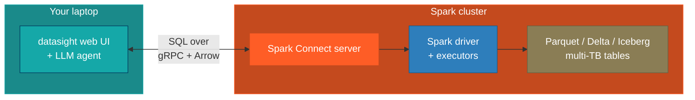

# Connect to an Apache Spark backend

This guide covers configuring datasight to talk to an Apache Spark cluster
over [Spark Connect](https://spark.apache.org/docs/latest/spark-connect-overview.html).
Use this when your data is too large to fit on a single machine — typically
multi-terabyte Parquet, Delta, or Iceberg tables managed by Spark.

## When to use this

Reach for the Spark backend when:

- **Your data is on a Spark cluster.** Generation data partitioned across
  years of `report_date`, plant-level fuel consumption at sub-hourly
  resolution, or any other multi-TB table set that a single laptop cannot
  scan.
- **Someone else runs the cluster.** A data platform team at your
  organization already operates Spark with Spark Connect enabled — you just
  need a URI and credentials.
- **You want aggregations, not row dumps.** datasight's agent is steered
  (via the system prompt) to always aggregate, always filter on partition
  columns, and never `SELECT *` on Spark tables. The results come back as
  small summaries suitable for a chart, not multi-gigabyte exports.

If your data fits on one machine, prefer DuckDB — it will be much faster
for interactive exploration.

## Overview

Spark Connect decouples the client from the cluster. datasight (the web UI
and LLM agent) runs on your laptop; the Spark driver and executors run on
your cluster. Your laptop never materializes more than a bounded slice of
any result.



Queries travel as Spark logical plans over gRPC. Results stream back as
Arrow record batches. datasight stops reading the stream once the
accumulated result exceeds `SPARK_MAX_RESULT_BYTES` (default 100 MiB) and
surfaces a truncation warning in the UI and to the LLM.

## Prerequisites

- A Spark cluster running **Spark 3.5 or newer** with the Spark Connect
  server enabled.
- The **Spark Connect URI** for that cluster — typically `sc://host:15002`.
  Ask your data platform team if you don't know it.
- A **bearer token** if the cluster requires authentication.

!!! tip
    If you're not sure whether Spark Connect is enabled, ask for the URI.
    Clusters running Databricks, EMR, or self-managed Spark with the
    `spark.api.mode=connect` config have a Connect endpoint.

## Step 1: Install the Spark extra

The Spark Connect client isn't bundled by default because it pulls in
pyspark. Install the extra on your laptop:

```bash
pip install 'datasight[spark]'
```

This adds `pyspark[connect]>=3.5` to your environment. No Java is
required — the Connect client is pure Python and talks to the cluster
over gRPC.

## Step 2: Configure the connection

In your project's `.env`:

```bash
# Use any LLM provider (see Getting Started for options)
ANTHROPIC_API_KEY=sk-ant-...

DB_MODE=spark
SPARK_REMOTE=sc://spark-connect.example.com:15002
SPARK_TOKEN=your_bearer_token            # optional, only if the cluster requires auth
```

### Tuning the byte cap

datasight caps client-side result size to protect your laptop (and, if you
host the web UI for others, the web server) from OOMing when the agent
writes a query that returns too much data. The default is 100 MiB on the
wire, which inflates to roughly 250–500 MiB as a pandas DataFrame.

Raise or lower the cap to match your environment:

```bash
# Default — safe for most laptops and small web deployments
SPARK_MAX_RESULT_BYTES=104857600         # 100 MiB

# Lower for memory-constrained environments
SPARK_MAX_RESULT_BYTES=26214400          # 25 MiB

# Higher if you trust the queries and have the RAM
SPARK_MAX_RESULT_BYTES=524288000         # 500 MiB
```

When a result is truncated, the UI shows a banner and the LLM sees a
partial-result warning in its tool output — so the agent can say "showing
the first 2M rows; add aggregation for the full answer" instead of
silently misreporting truncated data.

## Step 3: Describe the schema for multi-TB scale

datasight introspects tables automatically, but for Spark it deliberately
**skips row counts** — a naive `SELECT COUNT(*)` on a partitioned
multi-TB table kicks off a full-cluster job every time the project loads.

To help the agent write cheap queries, document your partition columns
explicitly in `schema_description.md`:

```markdown
## generation_fuel

Daily net generation and fuel consumption by plant, aggregated from the
EIA-923 hourly feed. Approximately 4 billion rows.

**Partition columns:** `report_date` (daily), `energy_source_code`.
Always include a `report_date` filter — e.g. `WHERE report_date >=
'2024-01-01'` — otherwise the query scans the full history.

**Columns:**
- `plant_id` (int) — EIA plant identifier
- `report_date` (date) — partition key
- `energy_source_code` (varchar) — partition key; 'NG', 'COL', 'NUC', 'WND', etc.
- `net_generation_mwh` (double) — MWh produced in the period
- `fuel_consumed_units` (double) — physical units of fuel consumed
- `fuel_consumed_mmbtu` (double) — heat content consumed
```

Partition hints in the schema description flow into the system prompt, so
the agent learns to write `WHERE report_date >= '2024-01-01' AND
energy_source_code = 'NG'` instead of full-table scans.

## Step 4: Run datasight

```bash
datasight run
```

datasight connects to the Spark Connect server via `spark.catalog.listTables()`,
pulls column metadata for each table, and starts the web UI at
<http://localhost:8084>. Ask a question and the agent writes Spark SQL
against your tables.

## Tips

- **Let the agent aggregate.** Questions like "total wind generation by
  month in 2024" return a tiny result (12 rows) even though the underlying
  table is terabytes. Questions like "show me every generation record in
  2024" will hit the byte cap — the agent will be told, and should
  re-plan as an aggregation.
- **Document partition columns** explicitly in `schema_description.md`.
  This is the single highest-leverage thing you can do to make Spark
  queries fast.
- **Watch for truncation banners** in the UI. If they appear on
  aggregated queries, your aggregation isn't grouping enough — the result
  is still too wide. Either narrow the time range or bucket more
  aggressively.
- **Server-side cancellation works.** If a query hits the `LLM_TIMEOUT`
  or you kill the session, datasight calls Spark Connect's `interruptTag`
  API so the cluster stops executing the job — cluster resources are
  freed, not left running in the background.
- **Keep credentials out of git.** `.env` should be in `.gitignore`
  (datasight adds it by default).
