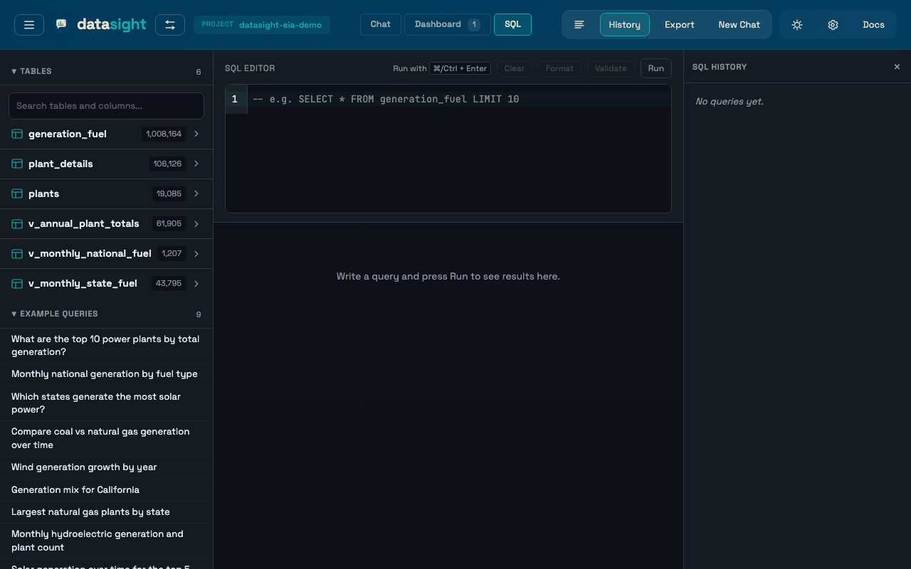

# Web UI reference

This page catalogs every panel, button, and section in the datasight web
UI. For task-oriented walkthroughs, see the How-to guides.

## Landing page

Shown when you open datasight with no project loaded.

### Guided starters

Four starter workflows that run immediately after data loads:

- **Profile this dataset** — deterministic overview of table sizes, date
  coverage, measure candidates, and likely dimensions
- **Find key dimensions** — likely grouping columns, suggested
  breakdowns, and join hints
- **Build a trend chart** — candidate date/measure pairs plus starter
  chart recommendations
- **Audit nulls and outliers** — null-heavy columns, suspicious numeric
  ranges, and quick QA notes

Starter results include follow-up actions (**Inspect Top Dimension**,
**Build a First Trend**, **Profile `<table>`**) that send a concrete
prompt into the chat workflow.

### LLM configuration

Shown only if no LLM provider is detected from environment variables.
Select a provider (Anthropic, Ollama, or GitHub Models), enter your API
key and model, and click **Connect**. Disappears once connected. Can also
be reached any time from the **Settings** panel (gear icon in the header).

### Explore Files

Enter the path to a data file or directory:

- **Single file** — `.csv`, `.parquet`, or `.duckdb`
- **Parquet directory** — a folder containing `*.parquet` files
  (hive-partitioned datasets)
- **DuckDB database** — opens directly with all its tables

### Open Project

Shows recent projects (click to open) and a path input for opening a
project directory manually. A project directory must contain
`schema_description.md`.

## Project structure

A project directory contains:

- `schema_description.md` — required, describes your data for the AI
- `.env` — optional, database connection and settings
- `queries.yaml` — optional, example queries
- `measures.yaml` — optional, measure aggregation overrides
- `time_series.yaml` — optional, temporal structure declarations
- `.datasight/` — auto-created, stores conversations, bookmarks, and
  reports

## Sidebar sections

Toggle the sidebar with the hamburger button in the header or
**Cmd/Ctrl+B**.

| Section | Purpose |
|---------|---------|
| **Tables** | Database tables, column types, preview rows, column stats |
| **Example queries** | From `queries.yaml`, filtered to the selected table |
| **Recipes** | Schema-derived reusable prompts |
| **Inspect** | Deterministic inspection flows (profile, measures, dimensions, quality, trends) |
| **Key measures** | Inferred metric roles, default aggregations, rollup hints |
| **Measure Overrides** | In-app editor for `measures.yaml` |
| **Bookmarks** | Saved prompts — click to populate the chat input |
| **Reports** | Saved SQL — click to re-execute |
| **History** | Past conversations — click to replay |

## Header

| Control | Action |
|---------|--------|
| **Hamburger** | Toggle sidebar |
| **datasight logo / switch icon** | Open project switcher |
| **Chat / Dashboard / SQL tabs** | Switch view (dashboard badge shows pinned count; SQL opens the query editor) |
| **New Chat** | Clear chat, SQL history, and dashboard |
| **History button** | Open the SQL query history panel |
| **Log button** | Toggle SQL query logging (highlights teal when on) |
| **Export** | Enter conversation export mode |
| **Gear icon** | Open Settings panel |
| **Toolbar toggles** | Clarify / SQL approval / SQL explanations (see [Query confidence toggles](query-confidence-toggles.md)) |

## Settings panel

Open from the gear icon in the header. Configures:

- LLM provider, model, API key, and base URL
- Query behavior toggles (SQL confirmation, explanations, clarifying questions)
- Display options (cost visibility and run details)

Also includes a **Project Health** section that checks `.env`, LLM
settings, database configuration, `schema_description.md`, `queries.yaml`,
`.datasight` writability, and live database connectivity. Refreshes
automatically after major project/explore transitions.

## Command palette

Press **Cmd/Ctrl+K** to open. Supports:

- view switching and panel toggles
- project switching
- schema navigation
- table preview and column stats actions
- starters and recipes
- bookmarks and saved reports
- conversation history
- dashboard composition actions

## Query history panel

Click the **History** button in the header. Shows every SQL query executed in
the current session — from the chat agent, from the SQL editor, and from
rerun reports — with:

- tool type (SQL or Chart)
- execution time and row count
- expandable SQL with syntax highlighting
- **Copy** and **Rerun** buttons
- **★** button to bookmark the query

Failed queries are highlighted with an orange border.

## SQL editor

Select the **SQL** tab in the header (or press **S**) to open a direct
SQL editor over the currently loaded project or explore session. Useful
when you want to tweak a query the agent generated, or write one from
scratch against the ephemeral DuckDB of your CSV/Parquet/Excel files without
leaving datasight.

The page contains:

- a multi-line SQL input
- a **Validate** button — runs a sqlglot parse and checks that every
  referenced table exists in the loaded schema (no database round-trip)
- a **Run** button — executes against the active database. **Cmd/Ctrl+Enter**
  inside the editor runs the query as well
- a result table with filtering, sorting, pagination, and CSV export
- database errors and validation messages shown inline

The schema (tables and columns) stays visible in the left sidebar while
you write. Each run is also appended to the **Query history** panel so
you can copy, rerun, or bookmark it.

!!! tip
    A typical flow: ask the agent a question in Chat, copy the generated
    SQL from the query history, switch to the SQL tab, paste, and edit
    — for example, broaden a `WHERE report_date >= '2024-01-01'` filter
    or add a `GROUP BY energy_source_code` to the agent's
    `net_generation_mwh` query.

## Result provenance

Pinned dashboard cards include a **Source** disclosure showing:

- the originating question
- tool type
- row and column counts
- execution time
- chart type
- generated SQL

The chat view can also show a **Run details** disclosure after each result.
It is off by default. Enable **Settings** -> **Query Behavior** -> **Show
Run Details** to show copyable provenance for new and replayed
conversation turns. The disclosure includes validation status, execution
metadata, formatted SQL, model, token usage, and **Copy JSON** / **Export
JSON** buttons.

Set `SHOW_PROVENANCE=true` in `.env` to make run details visible by
default. Session HTML exports include run details when the conversation
contains provenance events.

## Related reference

- [CLI reference](../../reference/cli.md) — every `datasight` subcommand
  and its flags (covers `run`, `ask`, `demo`, `inspect`, `quality`,
  `log`, `export`, and more).
- [Configuration reference](../../reference/configuration.md) —
  environment variables for `.env` (LLM provider, database connection,
  query behavior, project files).
