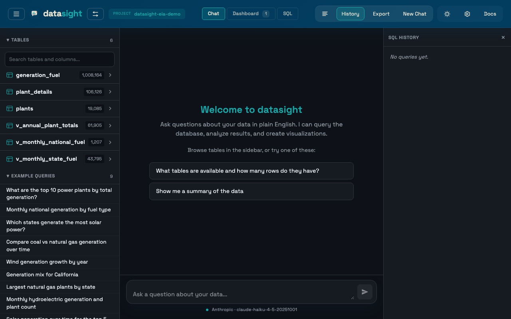

---
hide:
  - navigation
  - toc
---

# datasight

**AI-powered data exploration with natural language.** Point datasight at
your CSV, Parquet, or DuckDB files and start asking questions — no setup
required. Or create a curated project with schema descriptions and example
queries for your team. Start with guided starter workflows in the web UI or
use deterministic CLI inspection commands before involving the LLM.



```bash
uv tool install "datasight @ git+https://github.com/dsgrid/datasight.git"

# Explore files instantly — no project setup needed
datasight run
# Open http://localhost:8084, enter a file path, and start asking questions

# Or inspect a configured project without the web UI
datasight profile

# Or try a built-in demo dataset
datasight demo eia-generation ./my-project    # US power plants
cd my-project
# Edit .env with your API key (see Getting Started)
datasight run
```

## Documentation by role

datasight has three types of users. Pick the section that matches how you use
the tool — or start with [Users and roles](concepts/users-and-roles.md) for an
overview.

<div class="grid cards" markdown>

-   :material-account:{ .lg .middle } **[End user](end-user/tutorials/getting-started.md)**

    ---

    Get started, explore data through the web UI, ask questions, view charts,
    and review SQL.

    [:octicons-arrow-right-24: Explore US electricity generation](end-user/tutorials/getting-started.md)
    [:octicons-arrow-right-24: Explore files without a project](end-user/how-to/explore-files.md)

-   :material-database-cog:{ .lg .middle } **[Project developer](project-developer/schema-description.md)**

    ---

    Set up a datasight project for your team. Connect a database, write schema
    descriptions, curate example queries, and verify results across models.

    [:octicons-arrow-right-24: Schema description](project-developer/schema-description.md)

-   :material-code-braces:{ .lg .middle } **[Tool developer](tool-developer/architecture.md)**

    ---

    Contribute to datasight itself. Understand the architecture, LLM agent
    loop, and module structure.

    [:octicons-arrow-right-24: Architecture](tool-developer/architecture.md)

</div>
